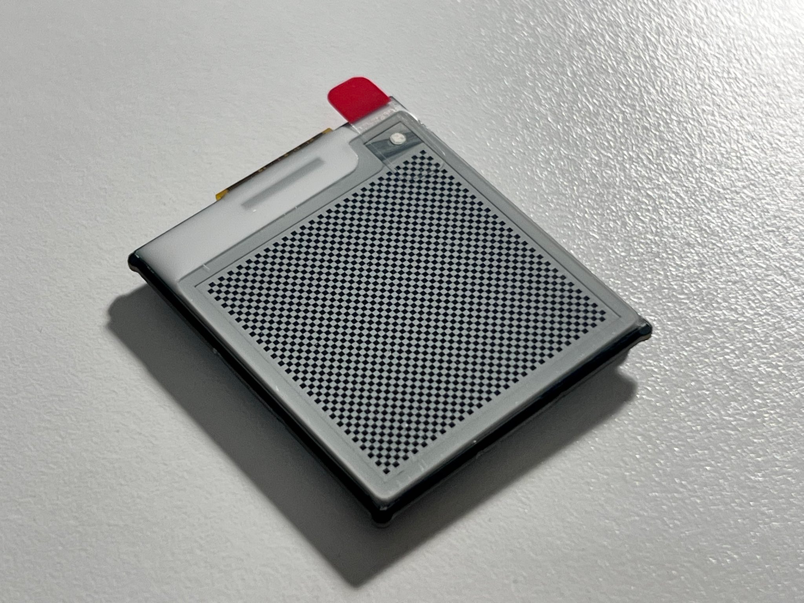

# Inkclip

Inkclip is an e-paper hair clip.

## Features

- It looks cool, if you are the type of person who thinks this kind of things look cool.
- Use it as more than a hair clip: a pin, a pocket clip, or just a gadget on your desktop.
- Update the pattern on the hair clip by simply connecting it to a computer via USB.
  - There is a ready-made web application you can use for this!
- Everything is open source: the hardware, the firmware, and the webapp.

## Physical characteristics

- Display size: 1.54 inches
- Resolution: 200 x 200 px
- Color: black and white
- Thickness (average): 2.60mm
- Thickness (thickest): 5.00mm (at micro-B port)
- Minimum weight (without mounting hardware): 6.5g
- Typical weight (with a 35mm hair clip): 8.0g
- Size: 33.40mm x 33.92mm
  - The shape of the device is a 32.80mm x 38.32mm rectangle with 1mm-radius dogbone corners.

## Project structure

- `hardware/` is the KiCad project for the Inkclip hardware.
- `firmware/` is a simple firmware for Inkclip that receives image bitmaps and then updates the entire display.
- `webapp/` is a web application for updating the display that works with the aforementioned firmware.

## Demo

